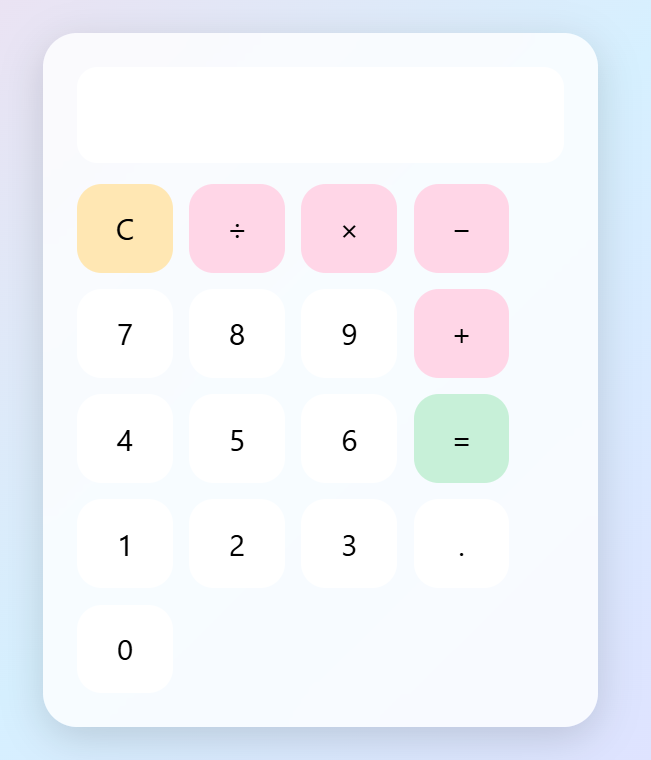
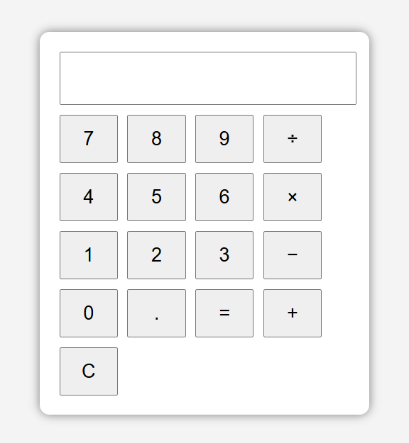
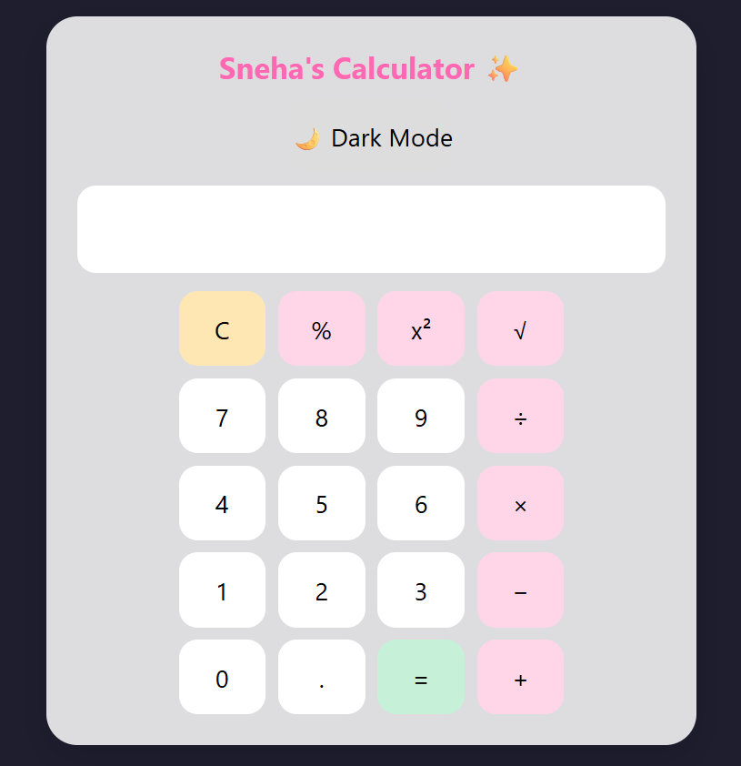

# CALCIFY 🧮

A collection of calculator projects built using HTML, CSS, and JavaScript.

## 🌐 Live Demo

Visit the project here:

https://cbsneha11-rgb.github.io/CALCIFY/

---

## 📸 Project Screenshots

### 🎨 Pastel Calculator

### 🧮 Basic Calculator

### ✨ Animated Calculator

---

## 🚀 Features

* Basic arithmetic operations
* Clean and user-friendly interface
* Pastel-themed design
* Animated visual effects
* Built entirely with HTML, CSS, and JavaScript

---

## 🛠 Technologies Used

* HTML5
* CSS3
* JavaScript

---

## 👩‍💻 Author

Sneha Saha

---

## 📚 Learning Outcome

This project helped me learn:

* HTML structure
* CSS styling
* JavaScript functionality
* GitHub repositories
* GitHub Pages deployment
* Project documentation with README files
